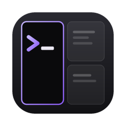

<div align="center">
  
  <h1>TOSS Terminal</h1>
  <p><strong>A lightweight, tiling terminal workspace for macOS.</strong></p>
</div>

---

TOSS Terminal is built on Tauri 2, Rust and React. It has a fast xterm.js
terminal, file explorer, Markdown viewer, code editor, web preview and source
control, and:

- **A terminal-style interface**: monospace, square corners, and no blur,
  shadows or animations, so the window stays light on CPU. `Cmd+Shift+'`
  hides the tab and status bars (search, messages and the prefix then float
  top right), `Cmd+B` the sidebar.
- **tuios-style tiling**: panes place themselves (BSP), with gaps and title
  bars (drag one to move the window); a `Ctrl+B` prefix drives them (`|` and
  `-` split, arrows move, `z` zoom, `x` close, `?` lists every key).
- **Spaces** for grouping tabs, and an **agents list** in the sidebar that
  tracks Claude Code, Codex and others running in your terminals ("works on a
  turn", "user input needed").
- **A see-through window** with macOS blur, at an opacity you choose.
- **A message line** for copies, pastes, closed panes and agents needing you,
  shown top right while there is one.
- **Keybinding presets**: Custom, iTerm2 or Ghostty pane keys.
- **Command corrections**, like Warp: when a command fails, its fix is
  offered at the next prompt (`→` takes it). Fixes come from what you
  retyped last time (`gti status` then `git status`), the closest installed
  program, or the tool's own "did you mean". Commands that only ever failed
  stop being suggested, in TOSS's suggestions and in zsh-autosuggestions.
  Learned locally, in a small file in the app's data folder.
- **Local dictation**: Cactus Compute's [Whistle](https://huggingface.co/Cactus-Compute/whistle)
  (16.9 MB, Apache-2.0) runs on the CPU inside the app, typed into the
  terminal as you speak. Nothing leaves your computer. Turn it on with
  **Dictation: turn on** in the command palette (or **mic** in the status
  bar), then `Ctrl+B Ctrl+Space`. Apple Silicon Macs and Linux
  (x86-64, arm64); not yet on Windows or Intel Macs.

## Install

Builds come from GitHub Actions (`fork-build`): download the
`toss-terminal-macos` artifact from the latest run, unzip it into
`~/Applications`, and open it. The app is unsigned, so macOS may ask you to
confirm the first launch.

Whistle downloads the first time you turn dictation on.

## Build from source

```sh
pnpm install
pnpm tauri build --bundles app --no-sign
```

Needs Node 24+, pnpm and Rust (stable); on Linux also `libc++-dev` and
`libc++abi-dev`. The build fetches Cactus Compute's prebuilt Needle engine
(`libneedle.a`, pinned by revision and SHA-256) from Hugging Face; to build
offline, put that file in a folder and set `NEEDLE_LIB_DIR` to it.

## Size

About 10 MB for the app, plus 17 MB for the speech model if you use
dictation.

## License

Apache-2.0. See [LICENSE](LICENSE) and [NOTICE](NOTICE). Original copyright
notices are kept; files changed from the original carry a "Modified for TOSS
Terminal" note.
